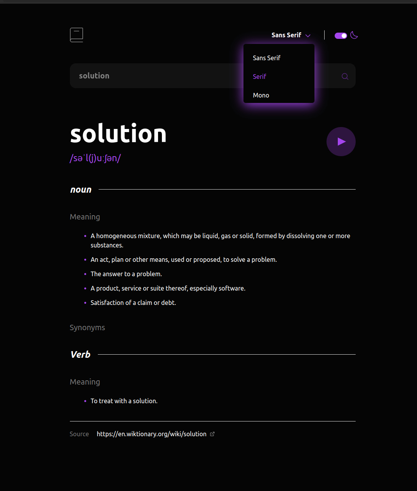

# Frontend Mentor - Dictionary web app solution

This is a solution to the [Dictionary web app challenge on Frontend Mentor](https://www.frontendmentor.io/challenges/dictionary-web-app-h5wwnyuKFL).

# Dictionary web app

### Links

- Solution URL: [here](https://github.com/mesganaG/dictionary-web-app)
- Live Site URL: [here](https://mesganag.github.io/dictionary-web-app/)

### Built with

- Semantic HTML5 markup
- CSS custom properties
- Flexbox
- CSS Grid
- Mobile-first workflow
- JavaScript - JS library

## Author
- Frontend Mentor - [@mesganaG](https://www.frontendmentor.io/profile/mesganaG)

